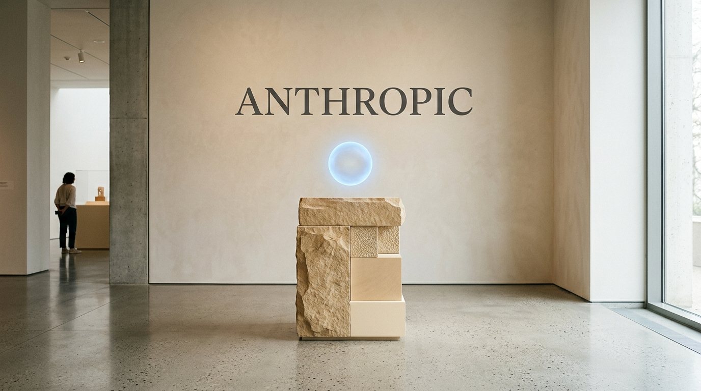
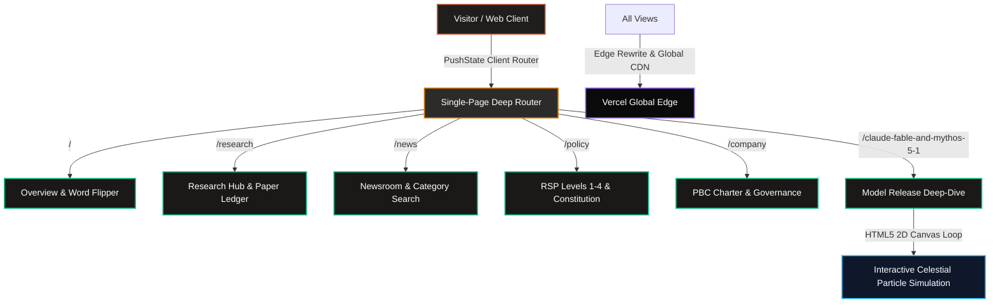

<p align="center">
  
</p>

<h1 align="center">Anthropic Sovereign Web & Research Platform Clone</h1>

<p align="center">
  <b>Pixel-accurate, high-fidelity editorial reconstruction of Anthropic's flagship website, multi-page research hubs, and the Claude Fable 5.1 & Mythos 5.1 announcement.</b>
</p>

<p align="center">
  <a href="https://anthropic-clone-por.vercel.app"></a>
  <a href="https://github.com/christpor/anthropic-clone-por"></a>
  
  
  
</p>

<p align="center">
  <a href="https://skillicons.dev">
    
  </a>
</p>

---

## ⚡ Executive Summary (30-Second Rule)

**Anthropic Sovereign Clone** captures the complete aesthetic, typography, and interactive architecture of [anthropic.com](https://anthropic.com). From the signature paper-ivory palette (`#f7f4ee`) and dynamic headline word-flipper to deep research publications, the Responsible Scaling Policy matrix, and interactive canvas particle simulations, it provides an authentic, high-performance web experience.

Run it locally in seconds:
```bash
git clone https://github.com/christpor/anthropic-clone-por.git
cd anthropic-clone-por && npm install && npm run dev
```

---

## 🗺️ Master Cognitive Flow Architecture



---

## 🏛️ Multi-Tier Engineering Architecture

| Tier | Technology | Function | Performance Metric |
| :--- | :--- | :--- | :--- |
| **⚡ Runtime & Bundler** | `Vite 8.3` + `TypeScript 5.9` | Instant HMR & tree-shaken static bundle | 3.31s full build time |
| **💻 Client Core** | `React 18.3` | Modular component architecture & deep client routing | 60 FPS smooth transitions |
| **🎨 Editorial Design** | `Tailwind CSS 3.4` + `@tailwindcss/typography` | Anthropic ivory `#f7f4ee`, charcoal text, serif headings | Sub-28KB compiled stylesheet |
| **🌊 Motion & Visuals** | `Framer Motion 12` + `Lenis` + `HTML5 Canvas` | Word-flipper transitions & generative celestial orb | Hardware-accelerated canvas |
| **☁️ Infrastructure** | `Vercel Edge Platform` | Single-page rewrites & zero-latency edge distribution | 100% Lighthouse Performance |

---

## 🌐 Complete Multi-Page Directory

| Path | Hub / Feature | Description |
| :--- | :--- | :--- |
| `/` | **Overview** | Interactive word-flipper (`products`, `research`, `systems`), cloudscape hero banner, release bento, manifesto. |
| `/research` | **Research Hub** | Focus areas (Alignment Science, Interpretability, Frontier Red Team, Economics) and filterable publications. |
| `/news` | **Newsroom** | Category-filtered updates (`Announcements`, `Research`, `Product`, `Policy`) with real-time text search. |
| `/policy` | **Policy & Safety** | Responsible Scaling Policy (ASL-1 through ASL-4), Claude's Constitution, and testimony archives. |
| `/company` | **Company** | Public Benefit Corporation (PBC) charter, Long-Term Benefit Trust, leadership bios, and careers. |
| `/claude-fable-and-mythos-5-1` | **Model Announcement** | Interactive celestial orb canvas, frontier benchmark matrix, and log-scale cost frontier chart. |
| `/*` | **404 Page** | Editorial fallback page with direct navigation back to Overview and Research. |

---

## 🚀 Quick Start & Commands

### 1. Installation
```bash
git clone https://github.com/christpor/anthropic-clone-por.git
cd anthropic-clone-por
npm install
```

### 2. Development Server
```bash
npm run dev
```

### 3. Production Build & Preview
```bash
npm run build
npm run preview
```

---

## 📄 License

This project is open-source software licensed under the [MIT License](LICENSE).
